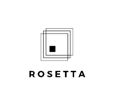

 

  

<strong>Jinwoo Kim, Vivian Yu, Kelly Wang, Jiali Liu, Lucy Zhu</strong>

## Abstract
While the UW Office of Global Affairs (OGA) relies on the Global Publications Dashboard to showcase UW faculty’s scholarship and worldwide collaborations, its user retention has decreased since the data source became outdated in 2019. Some users couldn’t find the desired information, such as statistics regarding the department’s global presence and international co-authorship. Additionally, some faculties’ work has not been acknowledged.

To address this issue, we retrieved 2 million rows of up-to-date data, improved the name-matching process, added indexing to increase database performance, and developed a networking tool to empower UW faculties to enhance global engagement and facilitate research collaboration.

## Project Overview
Link to https://www.washington.edu/global/publications/ 

The UW Office of Global Affairs (OGA) relies on the Global Publications Dashboard to showcase UW faculty publications and co-authorships. While this tool is important for demonstrating the influence of UW faculty and alumni on academic publications worldwide, its user retention has decreased since the data source became outdated in 2019. Our project aims to update the dashboard with current data from the OpenAlex API and enhance the website's functionality with user-centered features.

## Target Stakeholders
Stakeholders can access the Rosetta website through OGA's website. They will be able to view the dashboard to get an understanding of UW's publications and co-authorships around the world. However, since our website mainly serves UW faculties, users will need to log in with their UW credentials in order to utilize advanced features such as the Publications and the Scholars page. This is to maintain data integrity and for the development team to keep track of users' information as we allow users to upload their work. We want to prevent users from claiming publications that don't belong to them and support users from refreshing the database when they manually upload their work.

## Our Solution
#### Refreshed Data Dashboard
Since Microsoft Academic Graph stopped providing services, OGA decided to switch to OpenAlex as a new data source. We wrote a Python script to call on OpenAlex API and extracted 2M rows of updated publications data. The output dataset is published to OGA's MySQL server after going through another name-matching process with the UW HR database to facilitate data management and workflow at the production level. Therefore, we are able to visualize the global impact of the university by publishing a Tableau dashboard connected to the MySQL database.

#### Networking Tool
After having stakeholder interviews and user testings, we noticed that our stakeholders, UW faculties, are interested in the percentile of UW's relationship with other institutions as well as connecting with scholars whose publications they are interested in. Hence, we developed a networking tool where users can browse scholars' profiles and reach out to others via email. They can also bookmark publications that they want to come back to later and find these publications under their profile page. We also encourage scholars to manually upload their publications to help refresh our database.

## Project Status
As of May 3rd, 2023, the project is still ongoing. It will be transferred to the UW OGA for further development. For any questions, please contact Sudha Sharma at ssudha@uw.edu.